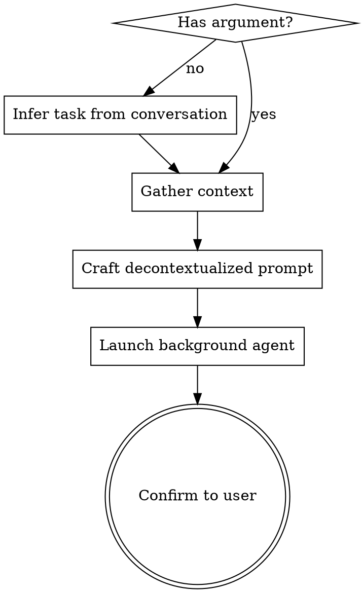

# Cleanroom

Launch an isolated background agent with no conversation context. You craft a detailed, self-contained prompt using your full context, then dispatch a read-only agent that sees only that prompt.

## Process



1. **Parse intent**: Use `$ARGUMENTS` if provided. If empty, infer the analysis task from conversation context — or ask the user if unclear.
2. **Gather context**: Read relevant files, search the codebase, run read-only commands — collect everything the background agent will need to understand the task without any conversation history.
3. **Craft the prompt**: Write a fully self-contained prompt following the decontextualization rules below.
4. **Dispatch**: Launch via `Agent` tool with `run_in_background: true` and `subagent_type: "general-purpose"`.
5. **Confirm**: Tell the user what you dispatched in 1-2 sentences, then continue the conversation.

## Decontextualization Rules

The prompt you craft is the ONLY thing the background agent sees. It has zero conversation history.

| Rule | Violation Example | Correct Example |
|------|-------------------|-----------------|
| **Self-contained** | "the file we discussed" | Full path: `/Users/foo/.local/share/chezmoi/dot_zshrc.tmpl` |
| **Specific** | "check the config" | "Analyze `private_dot_ssh/private_config.tmpl` for..." |
| **Inline critical code** | "look at the function" | Include the actual code snippet in the prompt |
| **Explicit goal** | "review this" | "Evaluate whether X handles Y. Return findings as..." |
| **Scoped** | (no boundaries) | "In scope: X, Y. Out of scope: Z." |
| **Read-only** | (no constraints) | "You may only read and search. Do not write or modify anything." |

## Prompt Template

Structure every crafted prompt like this:

```
You are a clean room analyst. You have NO prior context about this project or conversation.

## Constraints
- You are READ-ONLY. Use Read, Grep, Glob, and read-only Bash commands only.
- Do NOT use Write, Edit, MultiEdit, or any destructive Bash commands.
- Do NOT create files, modify files, or take any actions — only analyze and report.

## Background
[What the project/codebase is, relevant architecture, key files — everything
the agent needs to orient itself without conversation history]

## Task
[Exactly what to analyze, what questions to answer]

## Scope
- In scope: [specific files, directories, concerns]
- Out of scope: [what to ignore]

## Expected Output
[Format: structured report, severity ratings, numbered findings, etc.]
```

## Common Mistakes

- **Leaking context**: Using pronouns or references that only make sense with conversation history. Read your prompt as if you know nothing.
- **Under-specifying**: Saying "check for issues" instead of naming specific concerns. The agent can't read your mind.
- **Over-inlining**: Pasting entire large files instead of the relevant sections. Include what's needed, not everything.
- **Forgetting read-only**: Always include the constraints section. The agent has full tool access by default — the prompt is the only enforcement mechanism.
